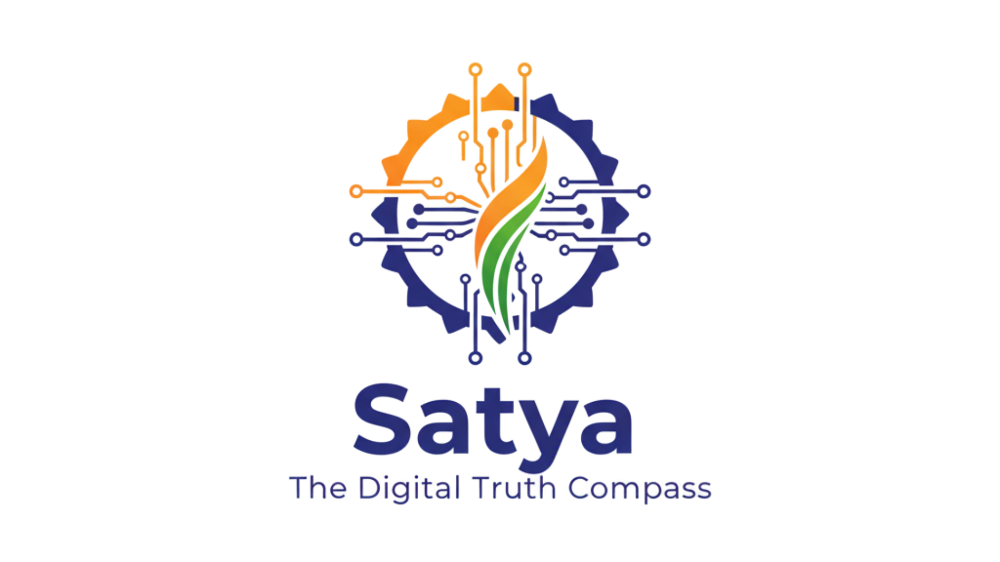

<div align="center">
  
  
  # Satya: The Digital Truth Compass
  
  *Empowering digital literacy through AI-powered misinformation detection and critical thinking education*
  
  [](https://satya-hackathon-project.web.app)
  
</div>

---

## 🚨 The Problem

In today's digital age, misinformation spreads faster than ever, particularly affecting Indian social media users who encounter fake news in multiple languages and formats. Traditional fact-checking tools only provide binary true/false answers, leaving users vulnerable to sophisticated manipulation techniques and unable to develop long-term critical thinking skills.

## 💡 Our Solution

**Satya** goes beyond simple fact-checking to become a comprehensive digital literacy platform. Rather than just telling users what to believe, Satya teaches them *how* to think critically about digital content. Our AI-powered system analyzes text, images, and URLs while educating users about manipulative techniques, logical fallacies, and source credibility - building lasting skills that protect against future misinformation.

## ✨ Key Features

- 🧠 **Multi-Modal Analysis**: Analyze content from text, URLs, and images with advanced AI detection
- 🎓 **The Technique Tutor**: Go beyond simple fact-checking to educate users on manipulative techniques and logical fallacies
- 🌐 **Source Credibility Score**: Evaluate the reliability of news sources and publication history
- 🔐 **Secure User Authentication**: Full sign-up and login system with Email/Password and Google OAuth
- 📖 **Personalized History**: Securely save and review all past analyses for learning reinforcement
- 🚨 **Health Misinformation Detection**: Specialized detection for dangerous medical claims (COVID-19 cures, etc.)
- 📊 **Detailed Scoring System**: Comprehensive truth health scores with breakdown explanations
- 🎨 **Intuitive User Interface**: Clean, responsive design optimized for all devices

## 🛠️ Tech Stack & Architecture

### Frontend
| Technology | Purpose |
|------------|---------|
|  | React framework with SSG/SSR |
|  | Type-safe development |
|  | Utility-first CSS framework |

### Backend & AI
| Technology | Purpose |
|------------|---------|
|  | Authentication & Hosting |
|  | Cloud Functions & AI Services |
|  | Gemini AI for content analysis |

### Architecture Overview
```
┌─────────────────┐    ┌──────────────────┐    ┌─────────────────┐
│   Next.js App  │────│  Firebase Auth   │────│   Firestore     │
│   (Frontend)   │    │  (Authentication)│    │   (Database)    │
└─────────────────┘    └──────────────────┘    └─────────────────┘
         │                       │                       │
         └───────────────────────┼───────────────────────┘
                                 │
                    ┌─────────────────────────┐
                    │  Google Cloud Functions │
                    │  + Vertex AI Gemini     │
                    │  (AI Analysis Engine)   │
                    └─────────────────────────┘
```

## 🚀 Local Setup Guide

### Prerequisites
- Node.js 18+ installed
- Firebase account
- Git installed

### Step-by-Step Installation

1. **Clone the Repository**
   ```bash
   git clone https://github.com/your-username/satya-truth-compass.git
   cd satya-truth-compass
   ```

2. **Install Dependencies**
   ```bash
   npm install
   ```

3. **Environment Configuration**
   
   Create a `.env.local` file in the root directory:
   ```env
   # Firebase Configuration
   NEXT_PUBLIC_FIREBASE_API_KEY=your_api_key_here
   NEXT_PUBLIC_FIREBASE_AUTH_DOMAIN=your_project.firebaseapp.com
   NEXT_PUBLIC_FIREBASE_PROJECT_ID=your_project_id
   NEXT_PUBLIC_FIREBASE_STORAGE_BUCKET=your_project.appspot.com
   NEXT_PUBLIC_FIREBASE_MESSAGING_SENDER_ID=your_sender_id
   NEXT_PUBLIC_FIREBASE_APP_ID=your_app_id
   ```

4. **Firebase Setup**
   ```bash
   # Install Firebase CLI globally
   npm install -g firebase-tools
   
   # Login to Firebase
   firebase login
   
   # Initialize Firebase (if needed)
   firebase init
   ```

5. **Run Development Server**
   ```bash
   npm run dev
   ```
   
   Open [http://localhost:3000](http://localhost:3000) in your browser.

6. **Build for Production**
   ```bash
   npm run build
   ```

### 🔒 Security Note
**Important**: Ensure your `.env.local` file is listed in `.gitignore` to prevent committing sensitive Firebase keys to version control.

## 📱 Usage Examples

### Analyzing Text
```
Input: "Drinking boiled water with ginger and lemon is a proven cure for COVID-19"
Output: Truth Health Score: 8/100 (Dangerous Health Misinformation)
```

### Analyzing Images
Upload suspicious news images and get detailed manipulation detection with confidence scores.

### URL Analysis
Paste article URLs to evaluate source credibility and content reliability.

## 🎯 Demo Scenarios

1. **Breaking News Detection**: Upload fake breaking news images
2. **Health Misinformation**: Test COVID-19 cure claims
3. **Source Verification**: Analyze news article URLs
4. **Manipulation Techniques**: Learn about logical fallacies and bias detection

## 🚀 Deployment

The application is deployed on Firebase Hosting:
- **Live URL**: https://satya-hackathon-project.web.app
- **Auto-deployment**: Configured via GitHub Actions

## 🤝 Contributing

1. Fork the repository
2. Create your feature branch (`git checkout -b feature/AmazingFeature`)
3. Commit your changes (`git commit -m 'Add some AmazingFeature'`)
4. Push to the branch (`git push origin feature/AmazingFeature`)
5. Open a Pull Request

## 📄 License

This project is licensed under the MIT License - see the [LICENSE](LICENSE) file for details.

## 🙏 Acknowledgments

- **Firebase Team** for providing robust authentication and hosting services
- **Google Cloud** for Vertex AI and Gemini capabilities
- **Next.js Team** for the excellent React framework
- **Tailwind CSS** for the utility-first CSS framework

## 📧 Contact

**Project Team**: Satya Development Team  
**Live Demo**: [https://satya-hackathon-project.web.app](https://satya-hackathon-project.web.app)

---

<div align="center">
  <strong>🌟 Fighting misinformation through education, one analysis at a time 🌟</strong>
</div>
